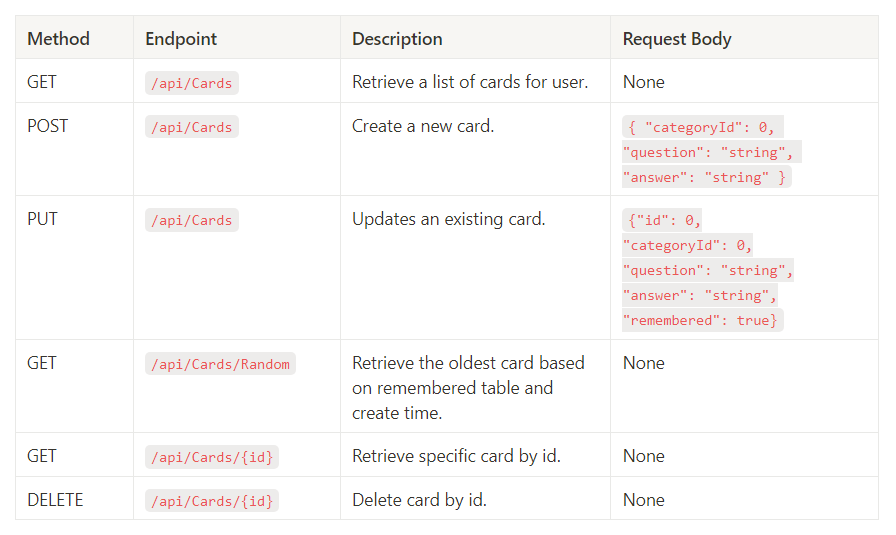

# WordFlow
An Anki app designed for efficient memorization through spaced repetition, helping users retain information more effectively. <br>
The following technologies were used to create the application: <br>
* Backend - .Net Rest API
* Frontend - React Native
    
## Table of Contents
* [General Information](#General-Information)
* [Technologies](#Technologies)
* [API Endpoints](#API-Endpoints)
* [Code Example](#Code-Example)

## Technologies
Frontend - React Native  
Backend - .Net Web API   
Backend Framework - .NET 8   
Used database - local Ms SQL <br><br>
Used packages:
* Microsoft.EntityFrameworkCore
* Microsoft.EntityFrameworkCore.Tools 
* Microsoft.EntityFrameworkCore.Design
* Microsoft.EntityFrameworkCore.SqlServer

## API Endpoints

**Authorizarion**
Access to endpoints requires logging in. Use Bearer token authentication for access. <br>
All API requests must include the Bearer token in the `Authorization` header:

```
Authorization: Bearer <your-token>
```

**Endpoints**



See source of tables [Cards Endpoints](https://gabby-collar-b50.notion.site/WordFlow-Anki-App-API-06b837024e774443bb84a24c1cdad81b?pvs=4")
